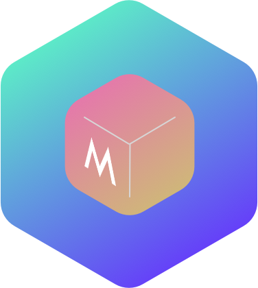

# Mineself

A service for deeply self-designed GTD and self time calculation workflow. Developed by Codegass Wei.

## Plan
The Structure Plan Version 0.0.1

Three Main Parts:
* service part for ML give advice.
* iOS part for virsualization and data collection.
* Web part for cross platform service and will build a set of RESTapi.

For ML part I choose classic ML algo as the start, and next step will try RL algo, such as TRPO.

For iOS part I choose Flutter to build the app running as the client. Or maybe in the future add more ability with Core-ML with Swift running locally.

For Web part I choose flask as the basic framework.

All three parts will be using the same database.